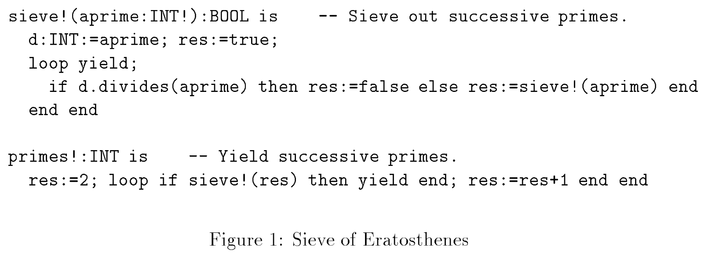

# Sieve of Eratosthenes

The [Sather](https://en.wikipedia.org/wiki/Sather) language developed at ICSI had rich language support for iters, object-oriented generic iterators.  [This paper](https://www.researchgate.net/publication/2623870_Sather_Iters_Object-Oriented_Iteration_Abstraction/link/02e7e5228a6bbebd8c000000/download) showed an elegant (though inefficient!) implementation of the [Sieve of Eratosthenes](https://en.wikipedia.org/wiki/Sieve_of_Eratosthenes) that has fascinated me since I was first to the implementation circa 1995.  ([This great video](https://www.youtube.com/watch?v=klcIklsWzrY) from Khan Academy explains and visualizes the Sieve of Eratosthenes quite well.)

## Goals of the experiment

My goal here was to use the C# iterator idiom as much as possible:

* `yield return` and `yield break` to automatically create enumerable collections

* `foreach` loops instead of manually controlling the `IEnumerable<T>` methods

* Try for as little code as possible to match the Sather implementation's terseness

## How it works
This implementation works like this:

* Initialize the current iterator as an interator that returns successive integers, starting at 2.
* For each element in the current iterator:

  * Yield the current number as a prime.
  * Create a new iterator, _feeding from the previous iterator_, that filters out any integers divisible by the current prime.  Set this new iterator as the current iterator.  (Note that we only do this until we reach the square root of our limit.)
  * Repeat until the current iterator returns a number above our desired limit.

So by the time we hit prime _P_, we have constructed a filtering iterator for each prime _p_ < _P_ that removes all composites of _p_.  If an integer gets through that chain of filters, it must itself be prime.

(One thing I did note was the Sather implementation didn't stop recursively adding sieves at the square root of *n*, but kept adding them all the way to the end.  I suppose fixing that would have made the example much less elegant, even if more performant.)

## Nesting IEnumerator<T> iterators
Once C# code enters a `foreach` loop, the compiler asks for an `IEnumerator<T>` from the thing being iterated.  Once the loop has grabbed that enumerator, it cannot be changed.  This means if I want to keep adding iterators to the chain, I either have to use a `while` loop and drive the interface manually or I have to create an `IEnumerator<T>` class that can change the enumerator on the fly.

At one point in this experiment I had a `HotSwappingEnumerator` class that did the latter: it was merely a proxy for a changeable `IEnumerator<T>` reference, passing calls to `MoveNext()` and `Current` to it.  This allows us to change the current enumerator _in the middle of the `foreach` loop_.  Awkward, indeed.  So I ended up just using a `while` loop.

## C# weirdness
This code does make a slight detour from normal C# idiom: instead of the iterator methods returning `IEnumerable<T>` (typically thought of as being required for using `foreach`), they return `IEnumerator<T>`.  This allows me to strictly control the creation of iterator state machine objects, the things that look like `<Foo>d__0`, instead of leaving it to the compiler.  When I used the more traditional method in a previous version, the `HotSwappingEnumerator` class used `IEnumerable<T>` and ended up having problems because the compiler decided to call `GetEnumerator()` on the iterators too often, causing a new state machine object to be instantiated, thus causing the iterators to effectively continually reset.  By using `IEnumerator<T>`, I control the allocation of state machine objects by providing my own `GetEnumerator()`--which just returns `this` on the current enumerator.

## Javascript version
[misc/sieve.html](misc/sieve.html) contains a Javascript version using generators.

## Conclusion
I think I can put this white whale to bed.
